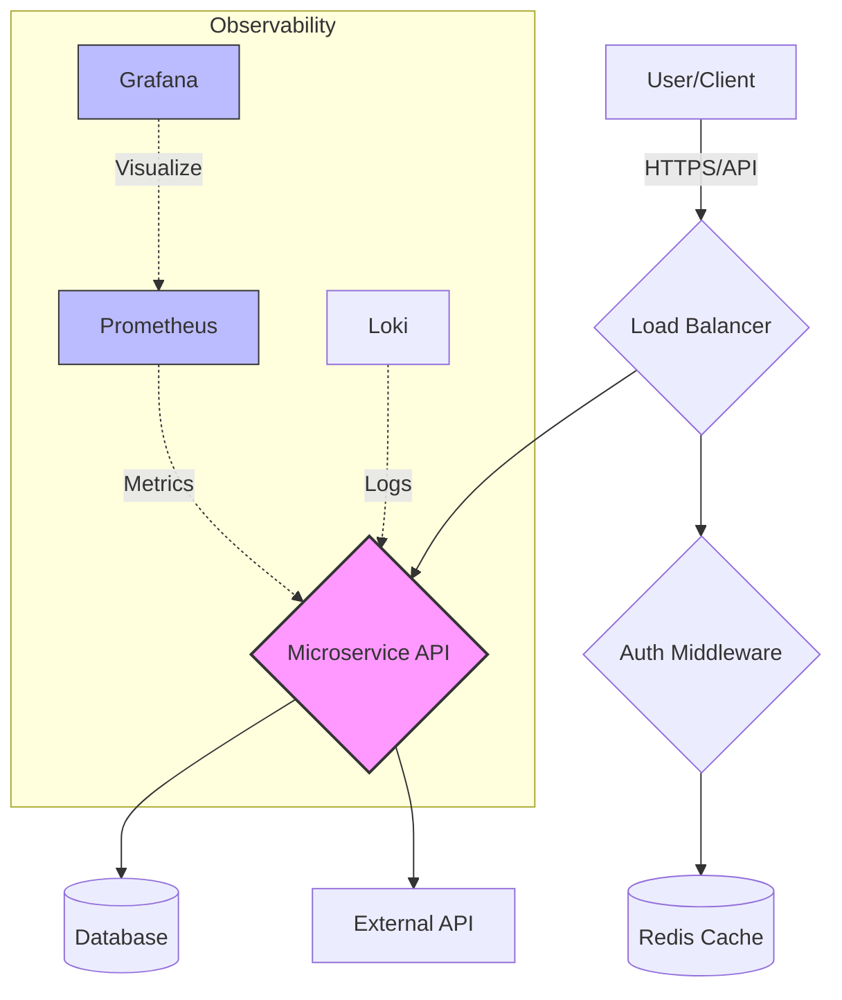

# Aws Eks Terraform Demo

Production-ready EKS cluster with Terraform, Fargate, and Prometheus monitoring.

## 🔍 TL;DR
> Automated EKS provisioning with serverless Fargate profiles and integrated observability.

## 🏗️ Architecture


## 🛠️ Tech Stack
AWS | Terraform | Kubernetes | Helm | Prometheus

## 🚀 Usage / Demo
### Local Setup
```bash
git clone https://github.com/yemisalako01-code/aws-eks-terraform-demo.git
cd aws-eks-terraform-demo
# Follow instructions in docs/azure-ci-cd-pipeline.md or docs/setup.md
```

### Demo Components
- **Architecture Diagram:** See [Architecture](#-architecture) section above.
- **Screenshots:** *(Placeholder for live demo screenshots)*
  - *Dashboard View:* [Link to GitHub Pages]
  - *Pipeline Execution:* [Link to Azure/Actions Run]

## 💡 Why This Matters
> Demonstrates advanced IaC skills, cost optimization strategies, and production-grade Kubernetes operations.

## 📚 Documentation
- [Architecture Decisions](docs/ARCHITECTURE_DECISIONS.md)
- [Deployment Guide](docs/DEPLOYMENT.md)
- [Contributing](CONTRIBUTING.md)

## 📜 License
MIT License - see [LICENSE](LICENSE)
